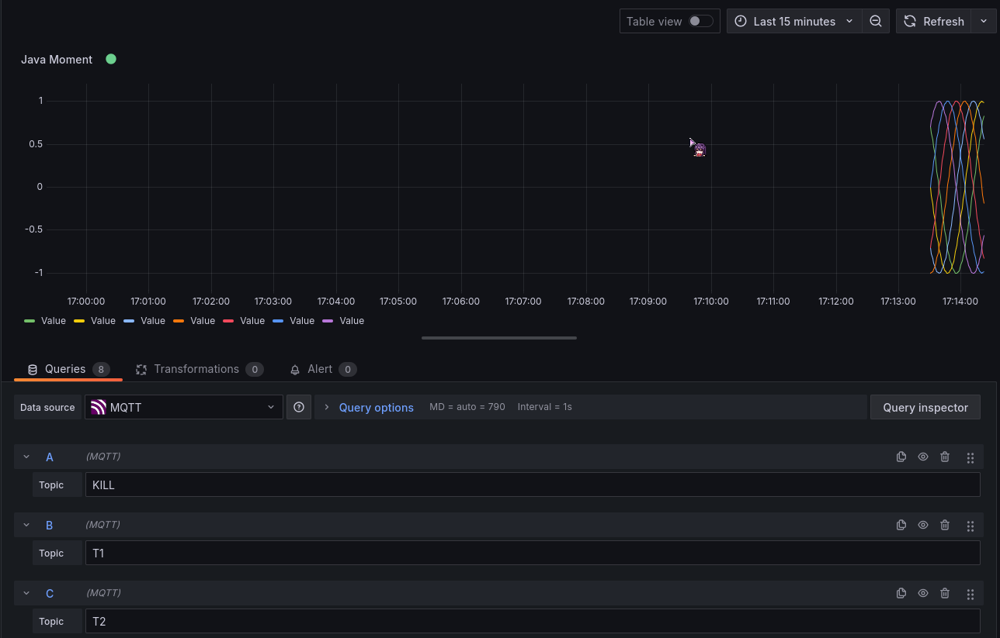

# MQTT

## Whats MQTT?
MQTT is a lightweight messaging protocol designed for devices with limited power or bandwidth. It's perfect for IoT devices just like sensors, cameras or embedded systems.

## Installation guide
### Docker
```bash
mkdir mosquitto
cd mosquitto
mkdir config data log
```
Next we'll create `mosquitto.conf` inside the `config/` folder.
```bash
touch config/mosquitto.conf
vim config/mosquitto.conf
```
and we'll put these lines in there
```conf
persistence true
persistence_location /mosquitto/data/
log_dest file /mosquitto/log/mosquitto.log
listener 1883
allow_anonymous true
```
Next we'll run a container now
```bash
docker run -d \
  --name mosquitto \
  -p 1883:1883 \
  -p 9001:9001 \
  -v "$(pwd)/config":/mosquitto/config \
  -v "$(pwd)/data":/mosquitto/data \
  -v "$(pwd)/log":/mosquitto/log \
  -v "$(pwd)/data.sh":/bin/data \
  eclipse-mosquitto
```
Additionally we can also add password protection by adding this to our config file
```conf
allow_anonymous false
password_file /mosquitto/config/passwordfile
```
also do this to the already existing container
```bash
docker run --rm eclipse-mosquitto mosquitto_passwd -c /mosquitto/config/passwordfile username
```
and then restart it
```bash
docker restart mosquitto
```
---
If you wish to use it with docker compose it would look this way
```yml
version: '3.8'

services:
  mosquitto:
    image: eclipse-mosquitto:latest
    container_name: mosquitto
    ports:
      - "1883:1883"  # MQTT Port
      - "9001:9001"  # WebSocket Port
    volumes:
      - ./config:/mosquitto/config
      - ./data:/mosquitto/data
      - ./log:/mosquitto/log
      - ./data.sh:/bin/data
    restart: unless-stopped
```
### Local
Note, this tutorial is for Fedora/RedHat related operating systems
---
First we install the required packages
```bash
sudo dnf install mosquitto mosquitto-clients
```
Next we enable the service for mosquitto
```bash
sudo systemctl enable --now mosquitto
```
if you wanna check if its running or not use this command
```bash
sudo systemctl status mosquitto
```
with the same config as before write it to `/etc/mosquitto/mosquitto.conf`
```bash
suduo vim /etc/mosquitto/mosquitto.conf
```
also open the firewall ports
```bash
sudo firewall-cmd --add-port=1883/tcp --permanent
sudo firewall-cmd --reload
```
## Testing
### Docker
```bash
docker ps # Check for the running mosquitto instance
docker exec -it <container_name_or_id> bash
mosquitto_pub -h localhost -t "test/topic" -m "Hello from Docker!" # Publish a message
mosquitto_sub -h localhost -t "test/topic" # Subscribe
```
### Local
```bash
mosquitto_pub -h localhost -t "test/topic" -m "Hello from Fedora!" # Publish a message
mosquitto_sub -h localhost -t "test/topic" # Subscribe
```
### Images


### Multi topic
You can create a `data.sh` and put the following inside
```bash
if [ -z "$1" ];
then
  echo "Usage: $0 sensor_name"
  exit 1
fi

SENSOR_NAME=$1
TOPIC="sensors/$SENSOR_NAME"

while true;
do
  VALUE=$(( RANDOM % 100 )) 
  mosquitto_pub -h localhost -t "$TOPIC" -m "$VALUE"
  sleep 1
done
```
also dont forget to bind the local `data.sh` to the `/bin/data` if you are using docker for this: `-v ./data.sh:/bin/data`.
Lastly you can read the data like this
```bash
mosquitto_sub -h localhost -t "sensors/#"
```
## Visualize data with Grafana
### Setup
Install grafana oss using these commands
```bash
sudo yum install https://dl.grafana.com/enterprise/release/grafana-enterprise-11.5.2-1.x86_64.rpm
sudo /bin/systemctl daemon-reload
sudo /bin/systemctl enable grafana-server.service
sudo /bin/systemctl start grafana-server.service
```
Next up open grafana over the `localhost:3000` address in your browser

The login credentials are

- admin
- admin

Next up go to Administration and click on Plugins and Data and then again Data
Search for the MQTT plugin and install it
Under connections and Data Sources and in there add these options:

Next up we setup a Dashboard

Add a Visualization and then add a topic, you can use # to add all topics and set the time at the top to the last 5 minutes


## How does the System work?
First we setup a publisher which just delivers data to a broker which subscribed to the publisher and is reading its data. We have also setup Grafana which just subscribes to the publishers and reads its data to visualize it.

# Java program
## Before we continue
For reference, the exact java file can be found [here](Java/Mosquitto/src/main/java/ch/bomba/mosquitto/App.java)
## What does the code do?
### Creating the Client
```java
MqttClient client = new MqttClient(ADDRESS, UUID.randomUUID().toString());
```
This creates an MQTT client that connects to the broker at `ADDRESS`.  
The second argument is a random client ID to make sure each instance has a unique identity.

### Connecting to the Broker
```java
client.connect();
```
This establishes the actual connection to the MQTT broker.

### Subscribing to a Topic
```java
client.subscribe(SUB, new IMqttMessageListener() {
    @Override
    public void messageArrived(String topic, MqttMessage message) throws Exception {
        System.out.println("Received Topic: " + topic + ", Message: " + message);
    }
});
```
This subscribes to the topic passed as `SUB` (coming from `args[1]`).  
Whenever a message is received on this topic, the `messageArrived` function is triggered and logs the topic and message.

### Creating a Message
```java
MqttMessage message = new MqttMessage(String.valueOf(value).getBytes());
```
This creates a new MQTT message where the payload is a string (in this case, the simulated sensor value) converted to a byte array.

### Publishing a Message
```java
client.publish(args[i], message);
```
This sends the message to the topic defined by `args[i]`, which is one of the sensor data topics passed via the command line.
## Usage
### Build
First, you have to build the jar file via
```bash
mvn clean package
```
### Execute
Execute the jar file via
```java
java -jar target/Mosquitto-1.0-jar-with-dependencies [URL] [ToSub] [ToPubArray]
```
### Visualized Data
Command:
```java
java -jar target/Mosquitto-1.0-jar-with-dependencies.jar tcp://localhost:1883 KILL KILL T1 T2 T3 T4 T5 T6 T7 &
```

As we can see you can still use Grafana like you are used to. As an example i have created 7 different topics which i was able to visualize with Grafana.
